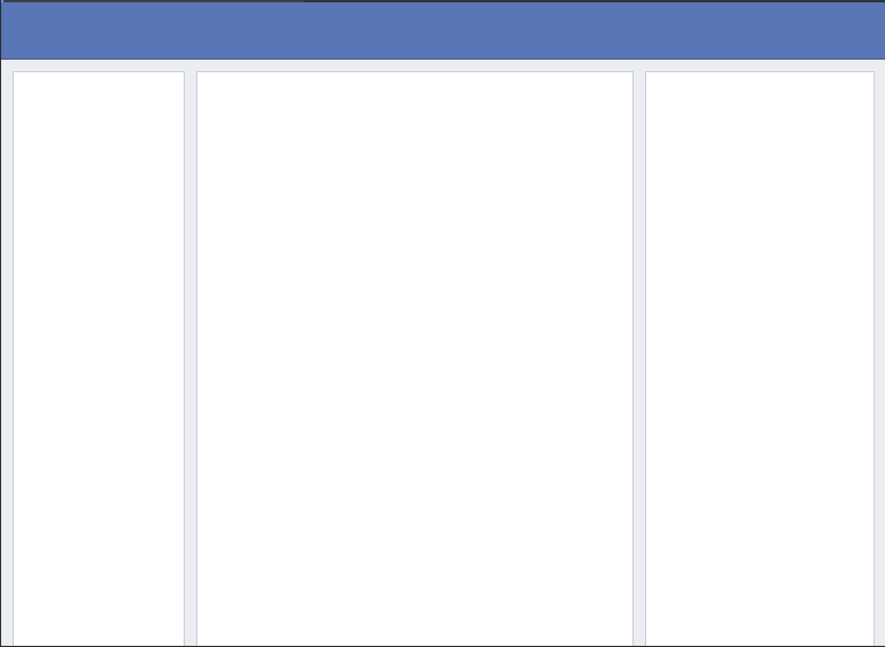
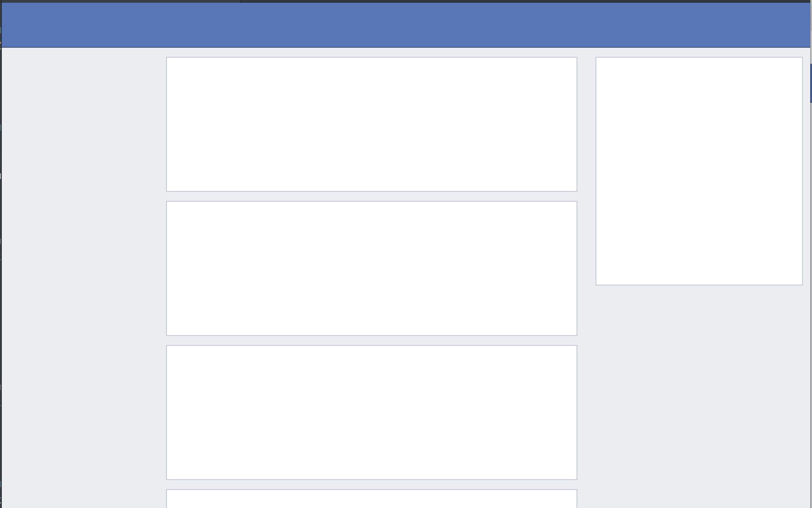
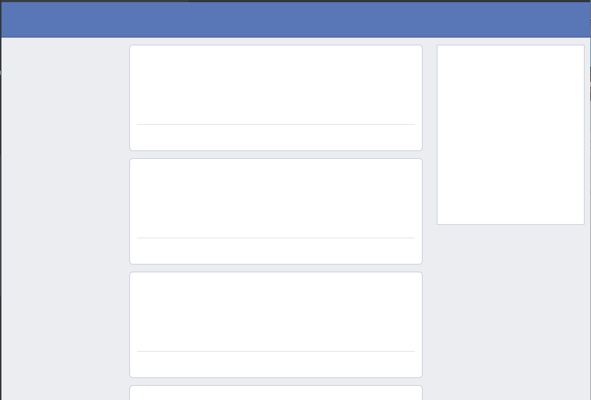
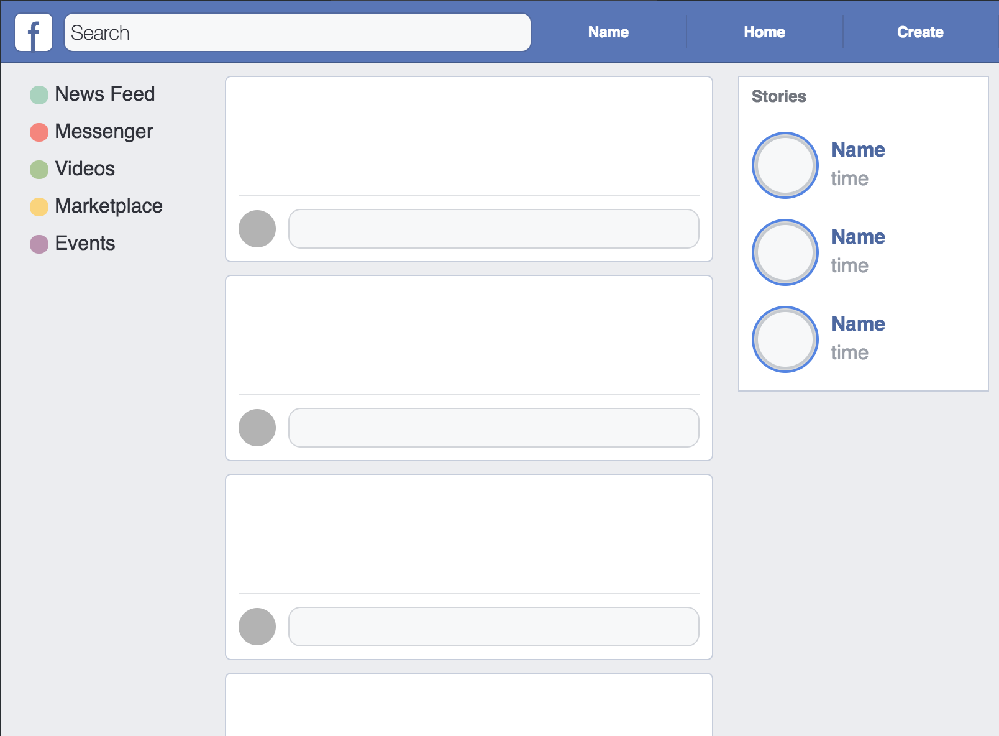

# Grids: Fakebook

## The Goal
Now that you've had some time to practice styling grids, we're going to take a look at designing something a little bit closer to what you might see when you're out in the depths of the internet. In this lab you won't just be styling html, you'll be working from the ground up to recreate mockups relevant to modern web design. Throughout the lab you'll be recreating mockups based on the websites that you see every day.

## The Lab

Either you, or someone you know, spends an absurd amount of time on facebook. In this part of the lab we'll be recreating a mockup of a classic facebook timeline. For each of the tasks below you'll be writing html in facebook_mockup.html and styling that html in facebook_mockup.css. Each step of this lab will help you on your way to achieve your final goal: to become Mark Zuckerberg... or finish a mockup of your facebook timeline. Whichever comes first.

#### Before you get started...
In previous labs you've been given most of the colors that you need to style your page. But in this lab you'll be finding and choosing the colors to match the mockup independently. Consider the following options while styling:
1. Guess a color until you get close.
2. Use your dev tools in google chrome, pull up facebook and find the colors in the styling.
3. Use a color picker browser extension like [this](https://chrome.google.com/webstore/detail/colorzilla/bhlhnicpbhignbdhedgjhgdocnmhomnp/related?hl=en) one here.

#### Step One: Outermost Grid
When you first look at a website, you'll want to develop an intuition for where the outermost grid lies. Look for the highest level of layout on the page. In this example, we'll be looking at the differentiation between the nav bar and the page content. Recreate the basic mockup you see below.

### Step Two: Nested Grids
As you experienced in the nested grid lab, it is possible to create grid layouts within items of another, higher level, grid. We'll focus on creating the grid within the page content here. Try to write the html here yourself, but if you're really unsure of where to get started you can check out the step_two.html file.

## Step Three: Keep Nesting...
If you take a look at your facebook page, you'll notice that your left sidebar doesn't actually have a square in it, your center area is split up into posts, and your right sidebar is not the height of the page.

## Step Four: Even more (you guessed it) nesting!
Here you can see the border used within your posts that demonstrates the separation between two nested grid items. Again, try to change your own html, but if you need some ideas you can look at the step_four.html file.

## Stretch Activity: Content
Add as many of the content additions from the mockup below to your own!

If you add all of the content above, try creating your own posts to fill the area grid items in the center column of the screen!
